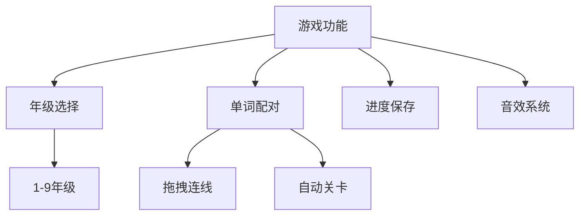
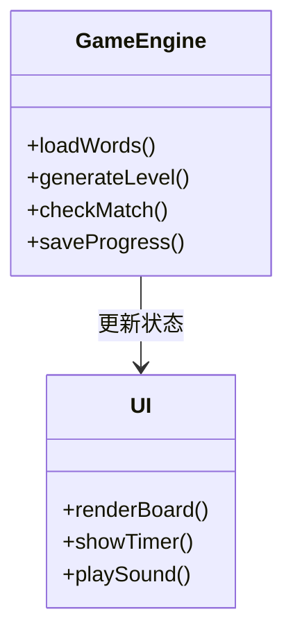
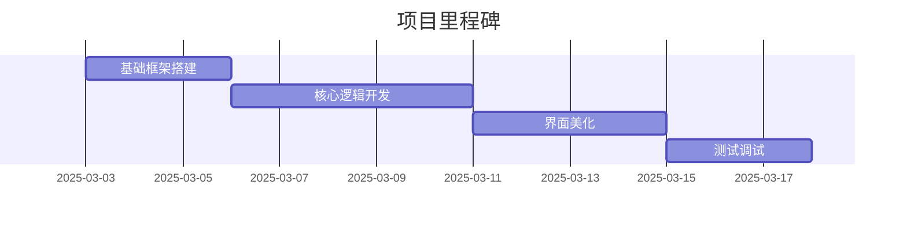

# 英语单词连连看游戏开发文档

## 项目概述


## 技术架构


## 数据结构示例（js/words.js）
```javascript
const wordData = {
  grade1: [
    { en: "apple", cn: "苹果", audio: "apple.mp3" },
    { en: "book", cn: "书", audio: "book.mp3" }
  ],
  //...其他年级数据
};
```

## 快速开始
1. 年级选择下拉菜单（HTML）
```html
<select id="grade-select">
  <option value="1">一年级</option>
  <!-- 2-9年级选项 -->
</select>
```

2. 游戏面板区域（HTML）
```html
<div class="game-board">
  <div class="words-column"></div>
  <div class="meanings-column"></div>
  <canvas id="connection-canvas"></canvas>
</div>
```

## 开发计划


## 待办事项
- [ ] 获取人教版官方单词表
- [ ] 录制/生成游戏音效
- [ ] 设计连线动画效果
